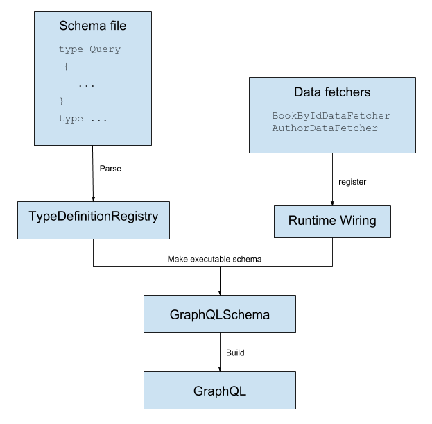

# Getting Started

### Reference Documentation
For further reference, please consider the following sections:

* [Official Gradle documentation](https://docs.gradle.org)
* [Spring Boot Gradle Plugin Reference Guide](https://docs.spring.io/spring-boot/docs/2.4.1/gradle-plugin/reference/html/)
* [Create an OCI image](https://docs.spring.io/spring-boot/docs/2.4.1/gradle-plugin/reference/html/#build-image)
* [Spring Web](https://docs.spring.io/spring-boot/docs/2.4.1/reference/htmlsingle/#boot-features-developing-web-applications)

### Guides
The following guides illustrate how to use some features concretely:

* [Building a RESTful Web Service](https://spring.io/guides/gs/rest-service/)
* [Serving Web Content with Spring MVC](https://spring.io/guides/gs/serving-web-content/)
* [Building REST services with Spring](https://spring.io/guides/tutorials/bookmarks/)

### Additional Links
These additional references should also help you:

* [Gradle Build Scans – insights for your project's build](https://scans.gradle.com#gradle)

### GraphQL

This is a demo for GraphQL Java. GraphQL Java Engine itself is only concerned with **executing queries**. It does not deal with any HTTP or JSON related topic. For there aspects, GraphQL Java Spring Boot adapter is used to take care of exposing API via Spring Boot over HTTP.

Main steps of creating a GraphQL Java server are:
1. Defining a GraphQL Schema.
2. Deciding on how the actual data for a query is fetched.

#### GraphQL Schema
The schema is defined in `schema.graphqls`. After defining the schema, we need to read it. Reading the schema is done by creating a GraphQLProvider class which will create a GraphQL instance in the init method.

The GraphQL instance is then exposed as a Spring Bean via the `graphQL()` method. GraphQL Java Spring adapter will use the GraphQL instance to make the schema available via HTTP on `/graphql`.

Next, GraphQLSchema instance need to be created in the `buildSchema` method which also contain the method to wires in code to fetch the data with `buildWiring` method. buildWiring uses the graphQLDataFetchers bean to register DataFetcher bean. 

#### DataFetchers

DataFetchers fetches the data for one field while the query is executed. Every field from the schema has a DataFetcher associated with it. If there is no DataFetcher for a specific field, then the default PropertyDataFetcher is used.

GraphQL does not dictate in any way where the data comes from. It can be from a static in memory list, database or an external service.

|Implementation|Status |
|---|---|
|Static memory list|Done|
|Database|In Progress|
|External Service/API|To-Do|